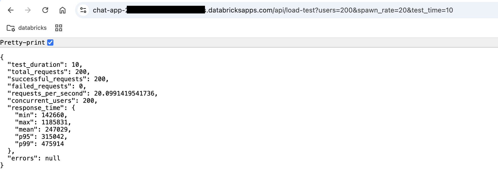

# AI Chat Application with Go Backend and Load Testing


*AI Chat Interface with real-time responses*

## Overview
This application is a full-stack chat interface powered by LLM, built with React frontend and Go backend, wrapped in a Python FastAPI service. It features comprehensive load testing capabilities and a modern UI.

### Key Features
- 🤖 AI-powered chat interface with LLM integration
- 🚀 High-performance Go backend server
- 🎨 Modern React UI with Tailwind CSS
- 📊 Built-in load testing using Vegeta
- 🔄 Real-time response handling
- 🌐 Python FastAPI wrapper for Databricks deployment for other languages such as Go, Rust, etc.

## Prerequisites
- Go 1.23+
- Python 3.8+
- Node.js 18.x+
- npm or yarn
- A Databricks workspace

## Environment Setup

1. Clone the repository:
```bash
git clone <repository-url>
```

2. Set up environment variables:
Create a `.env` file in the root directory:
```bash
SERVING_ENDPOINT_NAME=your_databricks_endpoint
DATABRICKS_API_KEY=your_api_key
DATABRICKS_APP_PORT=8000
```

## Building the Application

### Backend (Go Server)

1. Build the Go executable:
```bash
# From project root
go mod download
go build -o main main.go
```

2. Make the executable runnable:
```bash
chmod +x main
```

### Cross-Compilation for Linux

3. For Linux (from macOS or Windows) and to reduce the size of the executable:
```bash
# Set the target OS and architecture
GOOS=linux GOARCH=amd64 go build -trimpath -ldflags "-s -w" -o main main.go
```

### Frontend (React)

1. Navigate to the client directory:
```bash
cd client
```

2. Install dependencies:
```bash
npm install
```

3. Build the production version:
```bash
npm run build
```

### Python Wrapper

1. Create and activate a Python virtual environment:
```bash
python -m venv venv
source venv/bin/activate  # On Windows: .\venv\Scripts\activate
```

2. Install Python dependencies:
```bash
pip install -r requirements.txt
```

## Running the Application

1. Development Mode:
```bash
# Terminal 1 - Frontend
cd client
npm start

# Terminal 2 - Backend (Go server wrapped in Python)
python app.py
```

## Deployment to Databricks

1. Install the Databricks CLI:
```bash
brew install databricks
```

2. Configure Databricks CLI (if not already done):
```bash
# Configure Databricks CLI (if not already done)
databricks auth login --host <workspace-url>
```

3. Create app
```bash
databricks apps create chat-app
```

4. Create an `app.yaml` file in the root directory:

   ```yaml
   command:
   - "python"
   - "app.py"

   env:
   - name: "SERVING_ENDPOINT_NAME"
      valueFrom: "serving_endpoint"
   ```

   The `app.yaml` configuration runs FastAPI application. 
   The environment section defines `SERVING_ENDPOINT_NAME` which is configured (`serving_endpoint`) through apps creation in Databricks, securly storing and accessing sensitive values.

   For detials on how to create an app in Databricks, please refer to the [Databricks Apps Documentation](https://docs.databricks.com/en/dev-tools/databricks-apps/configuration.html).


4. Sync your local files to Databricks workspace:
```bash
# Add node_modules/ and venv/ to .gitignore first if not already present
databricks sync --watch . /Workspace/Users/<your-email>/chat-app
```

5. Deploy the app
```bash
databricks apps deploy chat-app --source-code-path /Workspace/Users/<your-email>/chat-app
```

The application will be available at your Databricks Apps URL:
- Production URL: https://chat-app-[id].cloud.databricksapps.com

### Important Deployment Notes

1. **Go Binary Compatibility**: 
   - Always build the Go executable for Linux as Databricks runs on Linux
   - Use `GOOS=linux GOARCH=amd64` when building
   - Ensure executable permissions with `chmod +x`

2. **Environment Variables**:
   - Update app.yaml with your production environment variables
   - Ensure all required secrets are configured in Databricks

3. **File Structure**:
   Your deployment directory should look like:
   ```
   chat-app/
   ├── main              # Linux Go executable
   ├── app.py           # Python FastAPI wrapper
   ├── requirements.txt # Python dependencies
   ├── app.yaml        # Databricks app config
   └── client/        # React build files
       └── build/     # Static frontend files
   ```


4. **Troubleshooting**:
   - Verify the Go executable is built for Linux
   - Check app logs for any startup errors
   - Ensure all dependencies are listed in requirements.txt
   - Verify environment variables are properly set

## Load Testing

The application includes built-in load testing using Vegeta, implemented in the Go server.

### Running Load Tests

1. Local App Testing:
```bash
curl "http://localhost:8000/api/load-test?users=200&spawn_rate=2&test_time=10"
```

2. Databricks Deployed App Testing:

*Run load tests in the Databricks Apps UI*

Parameters:
- `users`: Number of concurrent users
- `spawn_rate`: Users to spawn per second
- `test_time`: Duration of test in seconds

### Load Testing Scenarios

# Light load test
http://localhost:8000/api/load-test?users=100&spawn_rate=10&test_time=30

# Medium load test
http://localhost:8000/api/load-test?users=500&spawn_rate=50&test_time=30

# Heavy load test
http://localhost:8000/api/load-test?users=1000&spawn_rate=100&test_time=30


### Load Testing Best Practices

1. **Gradual Scaling**
   - Start with smaller numbers and gradually increase
   - Monitor system performance metrics
   - Watch for error rates and response times

2. **Production Testing**
   - Schedule load tests during off-peak hours
   - Alert relevant team members before large-scale tests
   - Monitor application logs and metrics during tests


## API Endpoints

- `GET /api/`: Health check endpoint
- `POST /api/chat`: Chat endpoint for LLM interactions
- `GET /api/load-test`: Load testing endpoint with Vegeta

## Rust Chat Server

The Rust chat server provides an alternative high-performance backend implementation that can be used instead of the Go server.

### Building the Rust Server

1. Navigate to the Rust server directory:
```bash
cd rust-chat-server
```

2. Build for development:
```bash
cargo build
```

3. Build optimized release version:
```bash
# For the current platform
cargo build --release

# Cross-compile for Linux (from macOS/Windows)
RUSTFLAGS='-C target-feature=+crt-static' cargo build --release --target x86_64-unknown-linux-musl
```

### Size Optimization

The Rust executable is optimized for size using the following configurations in `Cargo.toml`:
```toml
[profile.release]
opt-level = 'z'     # Optimize for size
lto = true          # Enable Link Time Optimization
codegen-units = 1   # Reduce parallel code generation units
panic = 'abort'     # Remove panic unwinding
strip = true        # Strip symbols from binary
```

### Running with FastAPI Wrapper

The Rust server can be run using the same FastAPI wrapper as the Go server. Update `app.py` to use the Rust executable:

```python
def start_rust_proxy():
    current_dir = os.path.dirname(os.path.abspath(__file__))
    rust_executable = os.path.join(current_dir, "rust-chat-server")
    
    # Set executable permissions
    os.chmod(rust_executable, stat.S_IRWXU | stat.S_IRGRP | stat.S_IXGRP | stat.S_IROTH | stat.S_IXOTH)
    
    try:
        process = subprocess.run([rust_executable],
                         capture_output=True,   
                         text=True)
        logging.info("Rust proxy server started successfully")
        return process
    except Exception as e:
        logging.error(f"Failed to start Rust proxy: {str(e)}")
        return None
```


